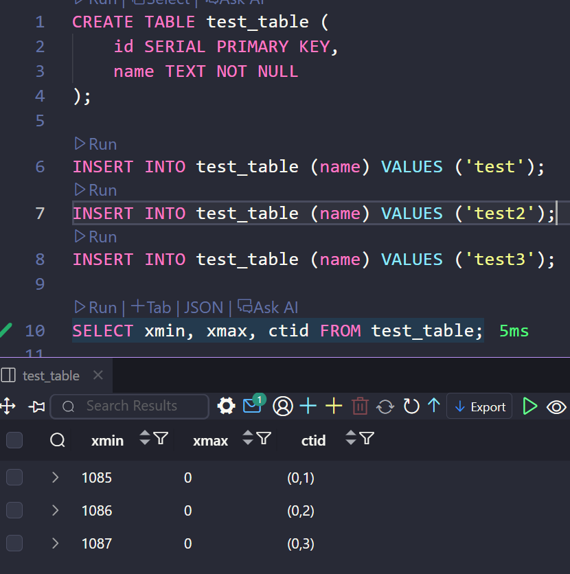
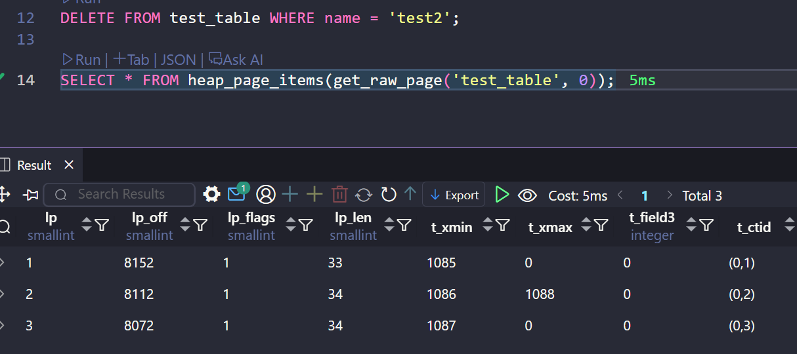
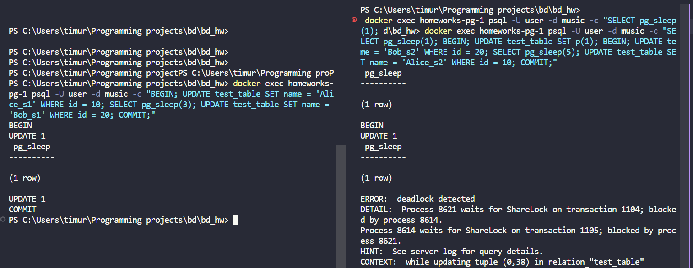
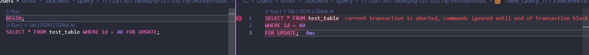
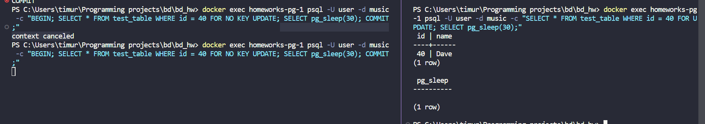
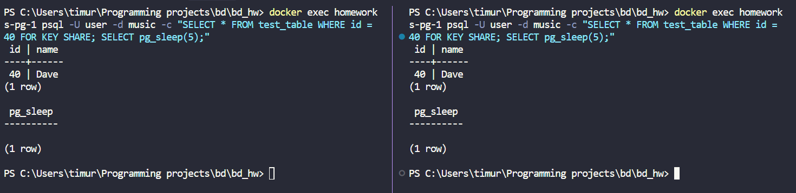
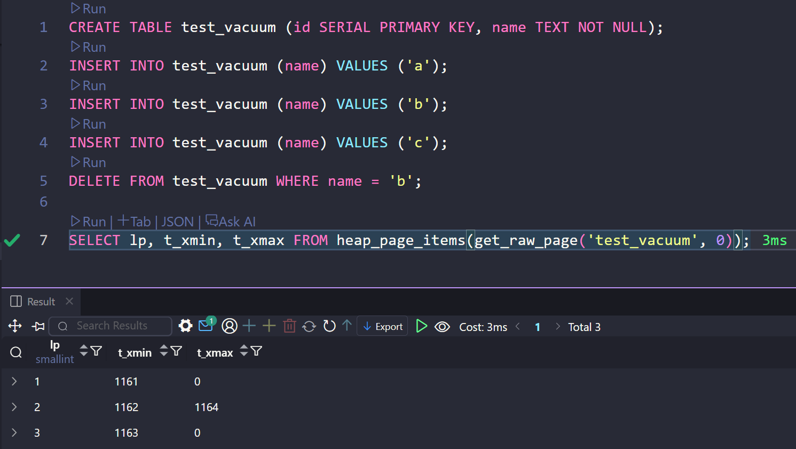
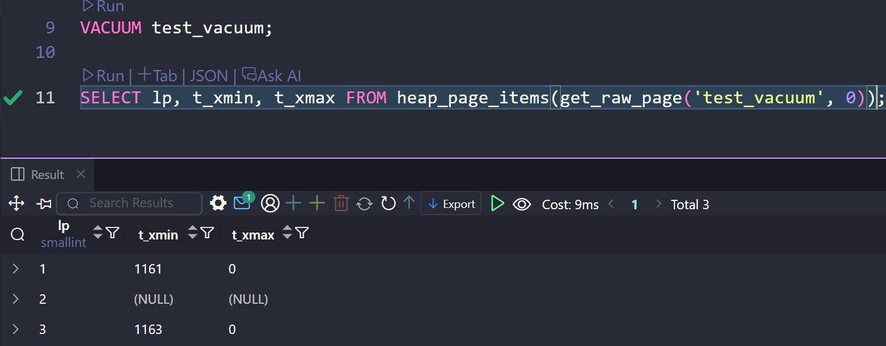

# ДЗ 4

## Задание 1 (смоделировать обновление данных )

Создаём таблицу и вставляем 3 записи, каждая в отдельной транзакции:

```sql
CREATE TABLE test_table (
    id SERIAL PRIMARY KEY,
    name TEXT NOT NULL
);

INSERT INTO test_table (name) VALUES ('test');
INSERT INTO test_table (name) VALUES ('test2');
INSERT INTO test_table (name) VALUES ('test3');
```

Каждая вставка выполнилась в своей транзакции — у каждой записи свой `xmin` (1085, 1086, 1087):



Удаляем запись `'test2'` и смотрим содержимое страницы через `heap_page_items`:

```sql
DELETE FROM test_table WHERE name = 'test2';
SELECT * FROM heap_page_items(get_raw_page('test_table', 0));
```

Несмотря на то что "живых" записей осталось 2, на странице по-прежнему хранятся 3 записи. Удалённая строка (с `t_xmin = 1086`) не была физически удалена — у неё лишь проставился `t_xmax = 1088`, указывающий на транзакцию, которая её удалила:



## Задание 2

`t_infomask` — битовая маска в заголовке каждого кортежа, содержащая информацию о состоянии строки.

### Сводная таблица флагов t_infomask

| Бит | Значение | Флаг | Описание |
|-----|----------|------|----------|
| 2^0 | 1 | `HEAP_HASNULL` | В строке есть NULL |
| 2^1 | 2 | `HEAP_HASVARWIDTH` | Есть поля переменной длины (varchar, text) |
| 2^2 | 4 | `HEAP_HASEXTERNAL` | Есть TOAST (значение вынесено в отдельную таблицу) |
| 2^3 | 8 | `HEAP_HASOID_OLD` | Строка имеет OID (устарело) |
| 2^4 | 16 | `HEAP_XMAX_KEYSHR_LOCK` | Лок: key-share |
| 2^5 | 32 | `HEAP_COMBOCID` | CID — комбинированный |
| 2^6 | 64 | `HEAP_XMAX_EXCL_LOCK` | Лок: exclusive |
| 2^7 | 128 | `HEAP_XMAX_LOCK_ONLY` | xmax — это лок, а не удаление |
| 2^8 | 256 | `HEAP_XMIN_COMMITTED` | Вставившая транзакция (xmin) закоммичена |
| 2^9 | 512 | `HEAP_XMIN_INVALID` | Вставившая транзакция (xmin) откатилась |
| 2^10 | 1024 | `HEAP_XMAX_COMMITTED` | Удалившая транзакция (xmax) закоммичена |
| 2^11 | 2048 | `HEAP_XMAX_INVALID` | xmax невалиден = строку никто не удалял |
| 2^12 | 4096 | `HEAP_XMAX_IS_MULTI` | xmax — это MultiXact (несколько локеров) |
| 2^13 | 8192 | `HEAP_UPDATED` | Строка появилась в результате UPDATE (не INSERT) |
| 2^14 | 16384 | `HEAP_MOVED_OFF` | Строка перемещена старым VACUUM |
| 2^15 | 32768 | `HEAP_MOVED_IN` | Строка перемещена на это место старым VACUUM |

### Разбор полученных значений

Получились числа 2306, 258, 2306:

| Строка | t_infomask | Разложение | Флаги |
|--------|-----------|------------|-------|
| 1 (`test`) | 2306 | 2048 + 256 + 2 | `XMAX_INVALID` + `XMIN_COMMITTED` + `HASVARWIDTH` |
| 2 (`test2`) | 258 | 256 + 2 | `XMIN_COMMITTED` + `HASVARWIDTH` |
| 3 (`test3`) | 2306 | 2048 + 256 + 2 | `XMAX_INVALID` + `XMIN_COMMITTED` + `HASVARWIDTH` |

- **Строки 1 и 3** (живые): `XMIN_COMMITTED` — вставка зафиксирована, `XMAX_INVALID` — никто не удалял. `HASVARWIDTH` — есть поле `text`.
- **Строка 2** (удалённая): `XMIN_COMMITTED` — вставка зафиксирована, но флага `XMAX_INVALID` нет — значит `xmax` валиден, строка удалена.

## Задание 3 (смоделировать дедлок)

Две параллельные сессии блокируют строки в `test_table` в противоположном порядке:

```sql
-- Session 1
BEGIN;
UPDATE test_table SET name = 'Alice_s1' WHERE id = 10;   -- лок на id=10
SELECT pg_sleep(3);                                       -- ждём, пока Session 2 залочит id=20
UPDATE test_table SET name = 'Bob_s1' WHERE id = 20;     -- блокируется — ждёт Session 2
COMMIT;

-- Session 2
SELECT pg_sleep(1);                                       -- ждём, пока Session 1 залочит id=10
BEGIN;
UPDATE test_table SET name = 'Bob_s2' WHERE id = 20;     -- лок на id=20
SELECT pg_sleep(5);                                       -- ждём, пока Session 1 попробует залочить id=20
UPDATE test_table SET name = 'Alice_s2' WHERE id = 10;   -- ⚡ DEADLOCK
COMMIT;
```

`pg_sleep` синхронизирует сессии так, что гарантированно возникает цикл ожидания:

| Время | Session 1 (PID 8614) | Session 2 (PID 8621) |
|-------|---------------------|---------------------|
| t=0s | `UPDATE id=10` — лок ✅ | `pg_sleep(1)` |
| t=1s | `pg_sleep(3)` | `UPDATE id=20` — лок ✅ |
| t=3s | `UPDATE id=20` — ждёт 🔒 | `pg_sleep(5)` |
| t=6s | всё ещё ждёт | `UPDATE id=10` — **DEADLOCK!** |

PostgreSQL обнаружил цикл и убил Session 2, Session 1 успешно закоммитилась:



- **Process 8621** (Session 2) ждёт `ShareLock` на транзакцию 1104 — заблокирован процессом 8614
- **Process 8614** (Session 1) ждёт `ShareLock` на транзакцию 1105 — заблокирован процессом 8621

## Задание 4 (блокировки на уровне строк)

### Матрица совместимости

| Удерживается ↓ \ Запрашивается → | `FOR KEY SHARE` | `FOR SHARE` | `FOR NO KEY UPDATE` | `FOR UPDATE` |
|---|:---:|:---:|:---:|:---:|
| **`FOR KEY SHARE`** | ✅ | ✅ | ✅ | ❌ |
| **`FOR SHARE`** | ✅ | ✅ | ❌ | ❌ |
| **`FOR NO KEY UPDATE`** | ✅ | ❌ | ❌ | ❌ |
| **`FOR UPDATE`** | ❌ | ❌ | ❌ | ❌ |

### Конфликт: FOR  UPDATE vs FOR UPDATE


### Конфликт: FOR NO KEY UPDATE vs FOR UPDATE


### Совместимость: FOR KEY SHARE vs FOR KEY SHARE



## Задание 5 очистка данных

```sql
CREATE TABLE test_vacuum (id SERIAL PRIMARY KEY, name TEXT NOT NULL);
INSERT INTO test_vacuum (name) VALUES ('a');
INSERT INTO test_vacuum (name) VALUES ('b');
INSERT INTO test_vacuum (name) VALUES ('c');
DELETE FROM test_vacuum WHERE name = 'b';

SELECT lp, t_xmin, t_xmax FROM heap_page_items(get_raw_page('test_vacuum', 0));

VACUUM test_vacuum;

SELECT lp, t_xmin, t_xmax FROM heap_page_items(get_raw_page('test_vacuum', 0));
```




Как видно из фото: до VACUUM у нас сохранялась запись об удаленной строке
после выполнения VACUUM она стала NULL