# Домашняя работа 6

В работе настроены два варианта репликации PostgreSQL:

- `Physical streaming replication` для кластера из 3 инстансов: `primary`, `standby1`, `standby2`
- `Logical replication` через `PUBLICATION` / `SUBSCRIPTION` для отдельной пары `publisher` / `subscriber`

## Архитектура

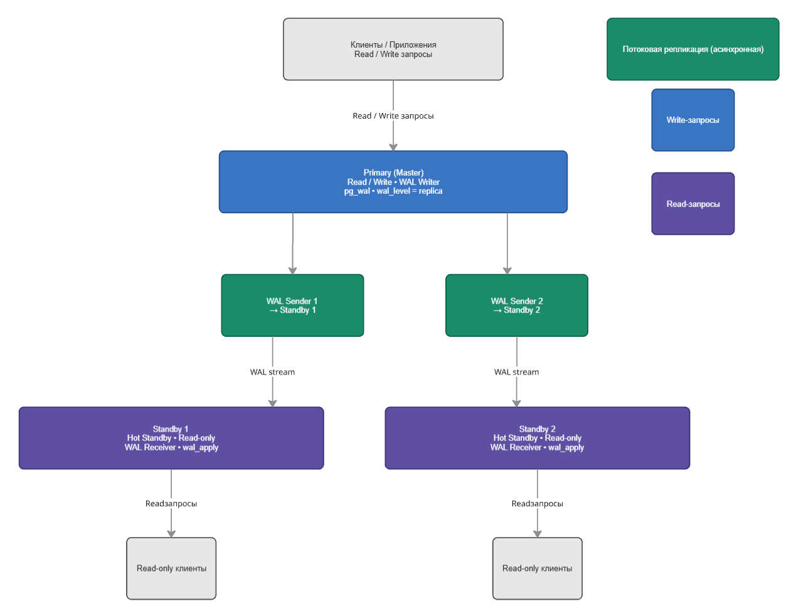

На схеме показан основной `Primary` сервер, который принимает `read/write` запросы и отправляет WAL-поток на две `standby`-реплики. Реплики работают в режиме `hot standby`, поэтому на них доступны только операции чтения.

## Physical streaming replication

Для physical replication подняты 3 PostgreSQL instance:

- `primary`
- `standby1`
- `standby2`

Настройка сделана в [`docker-compose.yml`](C:/Users/timur/Programming%20projects/bd/bd_hw/s2/homeworks/task-six/docker-compose.yml).

### Что было проверено

1. Развернуты три PostgreSQL instance.
2. Настроена physical streaming replication.
3. Проверена репликация данных с `master` на обе реплики.
4. Проверено, что запись на реплике запрещена.
5. Проверен replication lag при нагрузке `INSERT`.

### Скриншоты

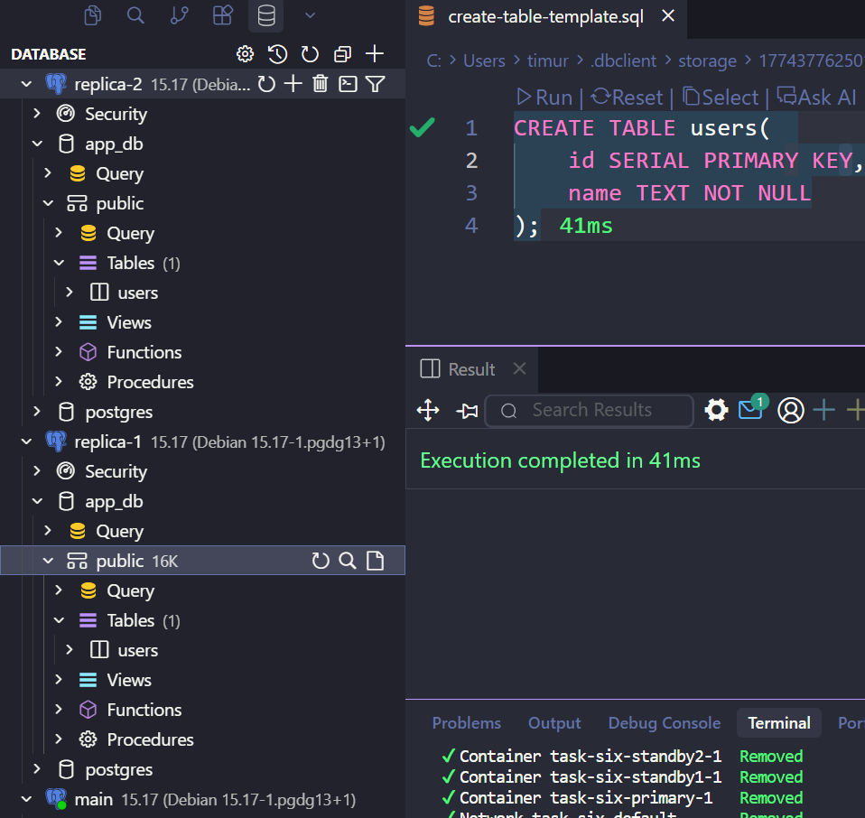

`1.png` показывает результат проверки physical replication в клиенте БД: таблица `users` присутствует на репликах, значит структура и данные были доставлены с primary.

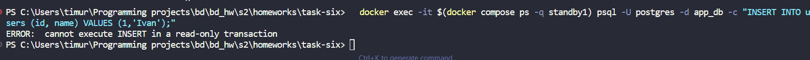

`2.png` показывает попытку выполнить `INSERT` на `standby1`. PostgreSQL возвращает ошибку `cannot execute INSERT in a read-only transaction`, что подтверждает read-only режим физической реплики.

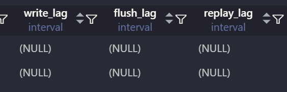

`3.png` показывает начальное состояние replication lag. Значения `write_lag`, `flush_lag`, `replay_lag` равны `NULL`, то есть на момент проверки отставание отсутствует или не успело накопиться.

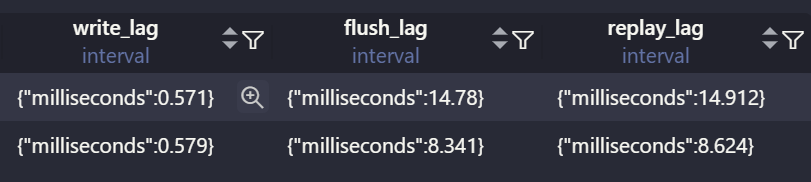

`4.png` показывает replication lag после создания нагрузки `INSERT`. Видно ненулевое значение `write_lag`, `flush_lag`, `replay_lag`, что подтверждает наличие отставания при активной записи на primary.

## Logical replication

Логическая репликация вынесена в отдельный стенд в папку [`logical`](C:/Users/timur/Programming%20projects/bd/bd_hw/s2/homeworks/task-six/logical).

Используются:

- `pg-publisher`
- `pg-subscriber`
- `PUBLICATION pub_demo`
- `SUBSCRIPTION sub_demo`

### Что было проверено

1. Настроена logical replication через `PUBLICATION` / `SUBSCRIPTION`.
2. Проверено, что `INSERT` в опубликованные таблицы реплицируется.
3. Проверено, что `DDL` не реплицируется.
4. Проверено поведение таблицы без `PRIMARY KEY`.
5. Проверен replication status.

### Скриншоты

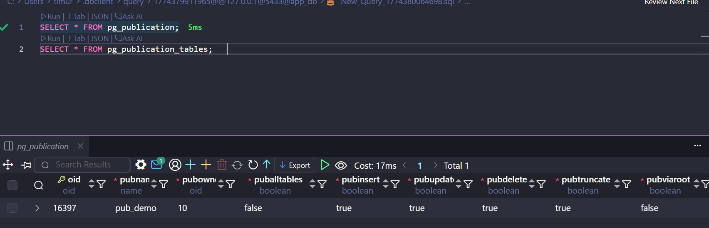

`5.png` показывает созданную публикацию `pub_demo` в `pg_publication`. Видно, что publication настроена и публикует операции `INSERT`, `UPDATE`, `DELETE`, `TRUNCATE`.

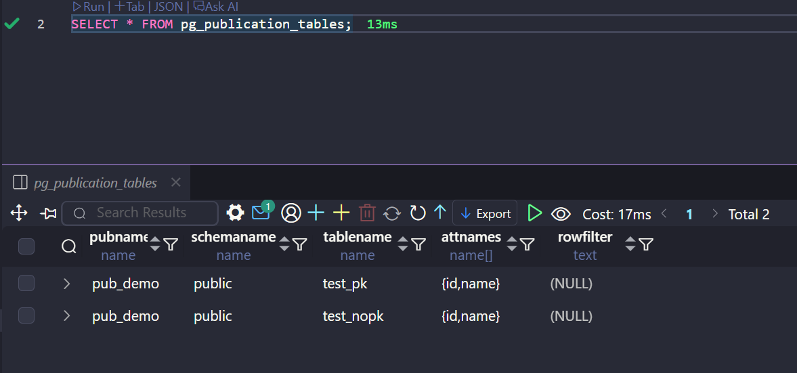

`6.png` показывает содержимое `pg_publication_tables`: в publication добавлены таблицы `test_pk` и `test_nopk`.

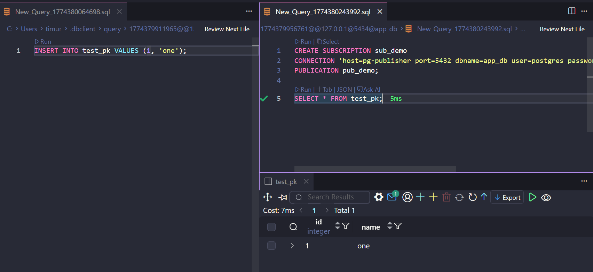

`7.png` показывает создание `SUBSCRIPTION sub_demo` на стороне subscriber и проверку таблицы `test_pk`. После `INSERT` на publisher строка появилась на subscriber, значит данные реплицируются.

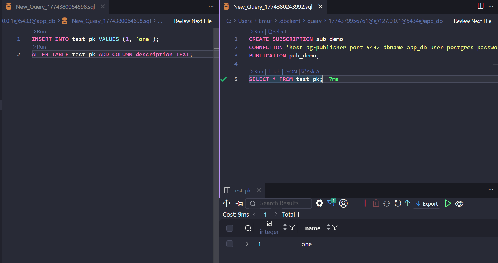

`9.png` показывает проверку отсутствия репликации `DDL`. На publisher выполнен `ALTER TABLE test_pk ADD COLUMN description TEXT`, но на subscriber структура таблицы не изменилась. Это подтверждает, что logical replication переносит данные, но не изменения схемы.

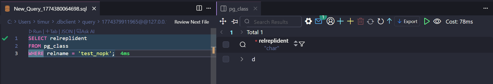

`10.png` показывает проверку `REPLICA IDENTITY` для таблицы `test_nopk`. Значение `relreplident = 'd'` означает `DEFAULT`, но у таблицы нет `PRIMARY KEY`, поэтому PostgreSQL не может однозначно идентифицировать строку для `UPDATE` и `DELETE`.

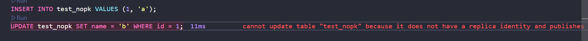

`11.png` показывает попытку выполнить `UPDATE` по таблице `test_nopk`, которая опубликована, но не имеет `PRIMARY KEY` и подходящего `REPLICA IDENTITY`. PostgreSQL возвращает ошибку, что обновление невозможно, потому что таблица не имеет replica identity и публикует updates.

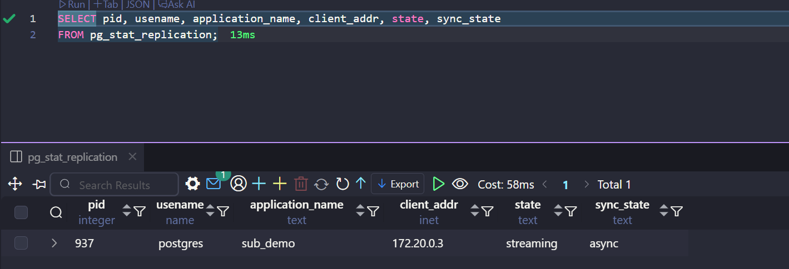

`12.png` показывает replication status на publisher через `pg_stat_replication`. Видно активное соединение от подписчика `sub_demo` в состоянии `streaming`, режим синхронизации `async`.

## Вывод

В ходе работы были настроены и проверены два механизма репликации PostgreSQL:

- `physical streaming replication` подходит для создания read-only standby-реплик на уровне WAL
- `logical replication` позволяет избирательно реплицировать данные таблиц, но не переносит `DDL`

Дополнительно показано важное ограничение logical replication: для `UPDATE` и `DELETE` таблица должна иметь `PRIMARY KEY` или корректно настроенный `REPLICA IDENTITY`.
