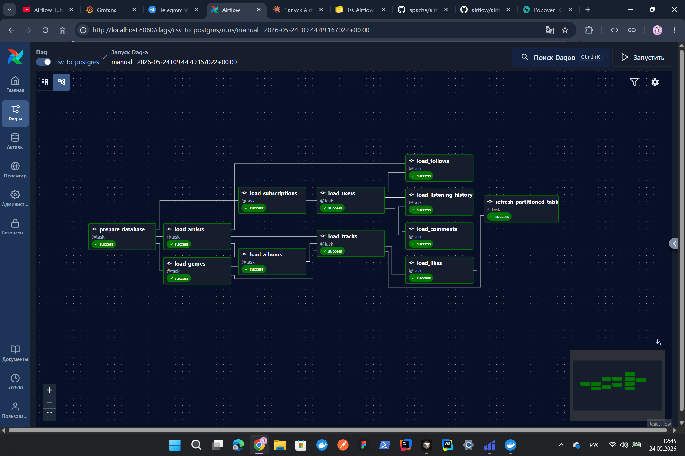
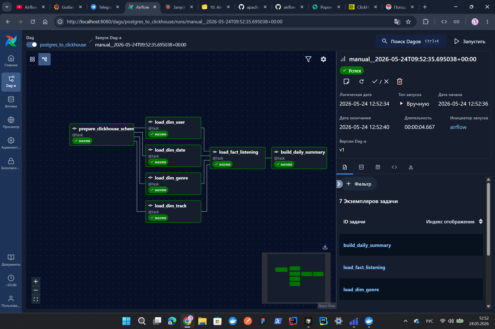
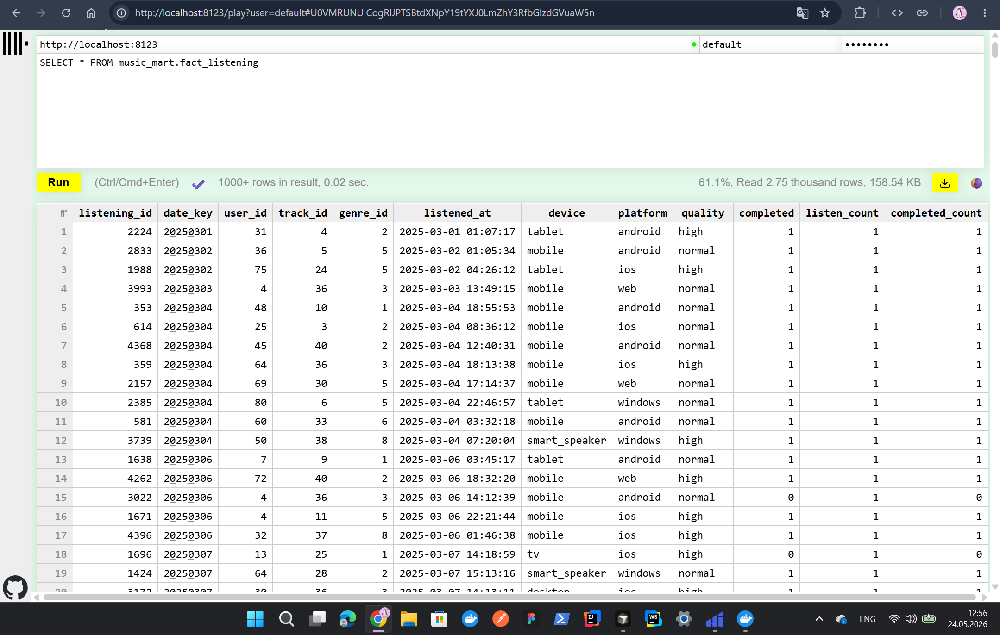
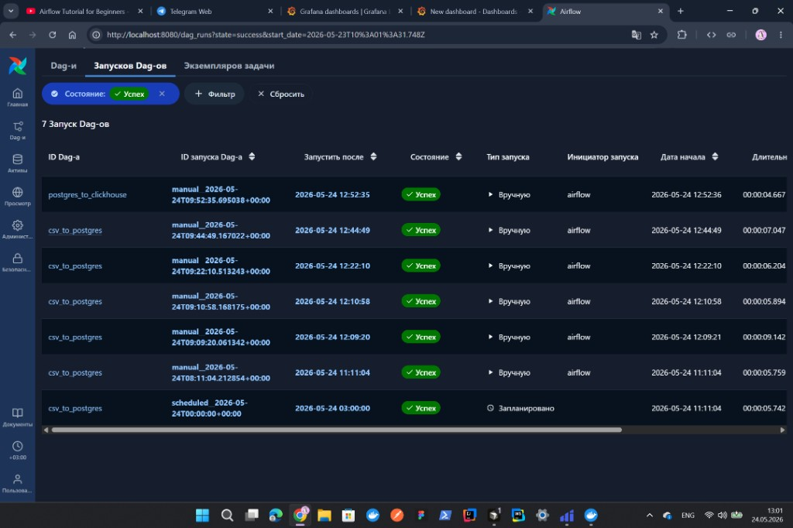
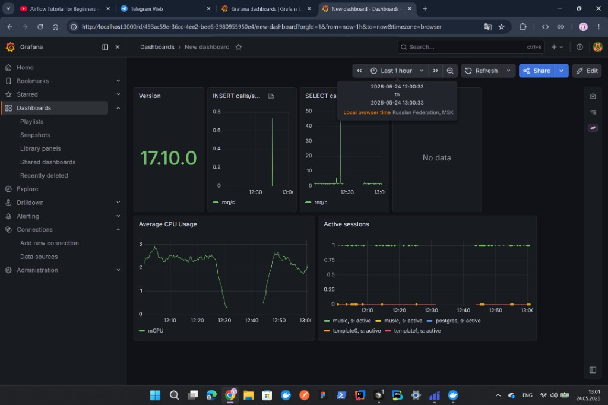

# ДЗ 10 — ETL-пайплайн: CSV/JSON → PostgreSQL → ClickHouse

Проект реализует двухэтапный пайплайн на Apache Airflow для музыкального стриминг-сервиса: загрузка seed-данных в операционную БД PostgreSQL и построение аналитической витрины в ClickHouse.

---

## 1. Источники данных

Используются **два формата** seed-файлов из каталога `data/seed/`:

| Формат | Файл | Таблица назначения | Записей |
|--------|------|-------------------|---------|
| **CSV** | `subscription.csv` | `subscription` | 4 |
| **JSON** | `genre.json` | `genre` | 8 |
| CSV | `user.csv` | `"user"` | 80 |
| CSV | `artist.csv` | `artist` | 12 |
| CSV | `album.csv` | `album` | 15 |
| CSV | `track.csv` | `track` | 40 |
| CSV | `listening_history.csv` | `listening_history` | 4 500 |
| CSV | `like.csv` | `"like"` | 600 |
| CSV | `follow.csv` | `follow` | 200 |
| CSV | `comment.csv` | `comment` | 150 |

**CSV** — основной источник для большинства сущностей.  
**JSON** — отдельный источник для справочника жанров (`genre.json` — массив объектов `{id, name}`).

Схема таблиц **не создаётся** DAG-ом: она заранее развёрнута Flyway-миграциями из `s2/homeworks/migrations/`.

---

## 2. Какие таблицы проекта пополняются

DAG `csv_to_postgres` наполняет таблицы схемы `music` (PostgreSQL):

| Таблица | Источник | Описание |
|---------|----------|----------|
| `subscription` | CSV | Тарифные планы |
| `genre` | **JSON** | Жанры музыки |
| `"user"` | CSV | Пользователи |
| `artist` | CSV | Артисты |
| `album` | CSV | Альбомы |
| `track` | CSV | Треки |
| `listening_history` | CSV | История прослушиваний |
| `"like"` | CSV | Лайки |
| `follow` | CSV | Подписки на артистов |
| `comment` | CSV | Комментарии к трекам |

Таблица `playlist` **очищается**, но seed-файла для неё нет — остаётся пустой.

После загрузки, если применена миграция `V5__partitioning.sql`, задача `refresh_partitioned_tables` синхронизирует партицированные таблицы:

- `listening_history_part`
- `track_part`
- `like_part`

---

## 3. Как устроен DAG 1 (`csv_to_postgres`)

**Файл:** `dags/dag_csv_to_postgres.py`  
**Расписание:** `@once`  
**Executor:** LocalExecutor (Airflow 3.2)

### Граф задач



```
prepare_database
    ├── load_subscriptions ──► load_users ──┬──► load_listening_history ──┐
    ├── load_genres ─────────┬──► load_albums ──► load_tracks ────────────┼──► refresh_partitioned_tables
    └── load_artists ────────┘              └──► load_likes ──────────────┤
                                            └──► load_comments ───────────┤
    load_users + load_artists ──► load_follows                             ┘
```

### Логика задач

1. **`prepare_database`** — `TRUNCATE` всех таблиц проекта с `RESTART IDENTITY CASCADE` под advisory lock.
2. **`load_*`** — параллельная/последовательная загрузка с учётом FK-зависимостей:
   - сначала справочники (`subscription`, `genre`, `artist`);
   - затем зависимые сущности (`album`, `user`, `track`);
   - в конце — факты взаимодействия (`listening_history`, `like`, `comment`, `follow`).
3. **`refresh_partitioned_tables`** — перезаливка партицированных таблиц из базовых (если они существуют).

### Механизм загрузки

- **CSV:** `COPY` во временную staging-таблицу → `INSERT ... ON CONFLICT (id) DO UPDATE`.
- **JSON:** `execute_values` в staging → тот же upsert.
- Загрузка идёт **только по колонкам из файла** — дополнительные колонки миграций получают значения по умолчанию.
- После каждой таблицы — синхронизация sequence (`setval`).

---

## 4. Как устроен DAG 2 (`postgres_to_clickhouse`)

**Файл:** `dags/dag_postgres_to_clickhouse.py`  
**Расписание:** `@once`

### Граф задач



```
prepare_clickhouse_schema
    ├── load_dim_date  ──┐
    ├── load_dim_user  ──┤
    ├── load_dim_track ──┼──► load_fact_listening ──► build_daily_summary
    └── load_dim_genre ──┘
```

### Логика задач

1. **`prepare_clickhouse_schema`** — `CREATE DATABASE/TABLE IF NOT EXISTS`, затем `TRUNCATE` каждой таблицы витрины (в ClickHouse truncate работает только по одной таблице).
2. **`load_dim_*`** — параллельная выгрузка измерений из PostgreSQL SQL-запросами, вставка в ClickHouse батчами по 10 000 строк (HTTP API, формат TabSeparated).
3. **`load_fact_listening`** — факт прослушиваний: join `listening_history` + `track`, фильтр `listened_at IS NOT NULL`.
4. **`build_daily_summary`** — агрегированная витрина `mart_daily_listens` поверх `fact_listening` + `dim_date`.

---

## 5. Какие таблицы создаются в ClickHouse

База данных: **`music_mart`**

| Таблица | Engine | Назначение |
|---------|--------|------------|
| `dim_date` | MergeTree | Календарное измерение |
| `dim_user` | MergeTree | Пользователи (страна, подписка) |
| `dim_track` | MergeTree | Треки (артист, альбом, жанр, mood) |
| `dim_genre` | MergeTree | Жанры |
| `fact_listening` | MergeTree, `PARTITION BY toYYYYMM(listened_at)` | Факт прослушивания (1 строка = 1 прослушивание) |
| `mart_daily_listens` | MergeTree | Агрегат по дням |

### Результат загрузки



Запрос `SELECT * FROM music_mart.fact_listening` возвращает **4 500 строк** — все прослушивания из PostgreSQL.

---

## 6. Аналитическая витрина

Построена **star-схема** (аналог OLAP-модели из ДЗ 9):

```
                    dim_date
                       |
dim_user ---- fact_listening ---- dim_track
                       |
                    dim_genre
```

**Зерно факта:** одна строка = одно прослушивание трека пользователем.

**Итоговая агрегированная витрина** — `mart_daily_listens`: готовый срез для ответа на вопрос «как менялась активность по дням».

Пример запроса к агрегату:

```sql
SELECT *
FROM music_mart.mart_daily_listens
ORDER BY full_date;
```

---

## 7. Какие метрики считаются

### На уровне факта (`fact_listening`)

| Поле | Описание |
|------|----------|
| `listen_count` | Счётчик прослушиваний (всегда 1 на строку) |
| `completed_count` | 1 — если трек дослушан до конца, иначе 0 |
| `completed` | Флаг завершённости прослушивания |

### На уровне агрегата (`mart_daily_listens`)

| Метрика | Формула |
|---------|---------|
| `total_listens` | `sum(listen_count)` — число прослушиваний за день |
| `unique_users` | `uniqExact(user_id)` — уникальные пользователи за день |
| `completion_pct` | `100 × sum(completed_count) / sum(listen_count)` — доля дослушанных треков, % |

Дополнительно в факте сохраняются срезы для ad-hoc аналитики: `device`, `platform`, `quality`, `genre_id`.

---

## 8. Как обеспечена идемпотентность

### DAG 1 — PostgreSQL

| Механизм | Описание |
|----------|----------|
| `TRUNCATE ... RESTART IDENTITY CASCADE` | Полная очистка перед загрузкой — повторный запуск даёт тот же набор данных |
| `INSERT ... ON CONFLICT DO UPDATE` | Безопасный retry отдельных задач без ошибок duplicate key |
| Staging-таблицы | Изоляция сырых данных перед upsert в целевую таблицу |
| `pg_advisory_xact_lock` | Защита от параллельных запусков |
| `max_active_runs=1` | Не более одного активного DAG run |
| `setval` после загрузки | Корректные sequences после явных `id` из seed |
| `refresh_partitioned_tables` | Пересоздание партиций из актуальных базовых таблиц |

### DAG 2 — ClickHouse

| Механизм | Описание |
|----------|----------|
| `CREATE ... IF NOT EXISTS` | Схема создаётся один раз |
| `TRUNCATE TABLE` перед загрузкой | Каждый запуск перезаписывает витрину целиком |
| `TRUNCATE` + `INSERT` для `mart_daily_listens` | Агрегат пересчитывается заново |
| `max_active_runs=1` | Исключение гонок при параллельных запусках |

---

## 9. Какие проверки качества данных реализованы

Явных отдельных DQ-задач (Great Expectations, SQL-checks) в DAG нет. Контроль качества обеспечивается **на уровне пайплайна и схемы**:

| Проверка | Где реализована |
|----------|-----------------|
| **Порядок загрузки по FK** | Граф зависимостей DAG 1: родительские таблицы загружаются раньше дочерних |
| **Соответствие колонок схеме** | Staging `LIKE target INCLUDING DEFAULTS`; COPY/JSON только по явному списку колонок |
| **Upsert по PK** | `ON CONFLICT (id)` — нет дубликатов при повторном запуске задачи |
| **Фильтрация некорректных фактов** | `WHERE listened_at IS NOT NULL` при выгрузке в ClickHouse |
| **Значения по умолчанию** | `COALESCE(quality, 'normal')`, `COALESCE(completed, true)` |
| **Проверка существования таблиц** | `_table_exists()` перед refresh партиций в PostgreSQL |
| **Синхронизация партиций** | `refresh_partitioned_tables` — партиции не расходятся с базовыми таблицами |
| **Контроль объёма загрузки** | Задачи `load_dim_*` и `load_fact_listening` возвращают количество загруженных строк (видно в логах Airflow) |

Ограничения целостности на уровне БД (PK, FK, CHECK) заданы в Flyway-миграциях и срабатывают при попытке загрузить некорректные данные.

---

## 10. Как запустить проект

### Предварительные требования

- Docker и Docker Compose
- Свободные порты: `5433` (PostgreSQL), `8123` (ClickHouse), `8080` (Airflow)

### Шаг 1. Операционная БД и ClickHouse

```bash
cd s2/homeworks
docker compose up -d pg flyway clickhouse
```

Flyway применит миграции `V1`–`V5` к базе `music`.

### Шаг 2. Airflow

```bash
cd s2/homeworks/task-tenth
cp env.example .env   # Linux/macOS
# copy env.example .env   # Windows

docker compose up -d
```

Airflow UI: [http://localhost:8080](http://localhost:8080)  
Логин по умолчанию: `airflow` / `airflow`

### Шаг 3. Запуск DAG-ов

1. **`csv_to_postgres`** — загрузка seed-данных в PostgreSQL.
2. **`postgres_to_clickhouse`** — построение витрины в ClickHouse (после успешного завершения первого DAG).

В UI: DAGs → выбрать DAG → **Trigger DAG**.

### Шаг 4. Проверка результатов

**PostgreSQL** (с хоста):

```bash
docker compose -f ../docker-compose.yml exec pg psql -U user -d music -c "SELECT 'listening_history' AS t, COUNT(*) FROM listening_history;"
```

**ClickHouse**:

```bash
docker exec clickhouse-lab clickhouse-client --password password -q "SELECT count() FROM music_mart.fact_listening"
docker exec clickhouse-lab clickhouse-client --password password -q "SELECT * FROM music_mart.mart_daily_listens ORDER BY full_date LIMIT 10"
```

Или через Play UI: [http://localhost:8123/play](http://localhost:8123/play)

### Переменные окружения (`.env`)

| Переменная | Значение |
|------------|----------|
| `POSTGRES_DSN` | `host=pg port=5432 dbname=music user=user password=password` |
| `CLICKHOUSE_DSN` | `http://clickhouse:8123` |
| `CLICKHOUSE_USER` | `default` |
| `CLICKHOUSE_PASSWORD` | `password` |
| `CLICKHOUSE_DATABASE` | `music_mart` |

---

## 11. Запуски DAG и влияние на метрики

### История запусков в Airflow



24 мая 2026 DAG-и отрабатывали последовательно:

| DAG | Запусков | Время | Длительность |
|-----|----------|-------|--------------|
| `csv_to_postgres` | 6 (1 по расписанию + 5 вручную) | 11:11 – 12:44 | 5–9 с |
| `postgres_to_clickhouse` | 1 (вручную) | **12:52:36** | **4.7 с** |

Первый DAG запускался несколько раз вручную — проверялась идемпотентность загрузки (повторный `TRUNCATE` + upsert не ломает данные). Финальный успешный прогон `csv_to_postgres` завершился в **12:44**, после чего в **12:52** был запущен `postgres_to_clickhouse` для построения витрины в ClickHouse.

### Метрики PostgreSQL в Grafana



Дашборд Grafana (окно **12:00–13:00 MSK**) показывает, как активность DAG-ов отражается на PostgreSQL:

- **~12:25** — всплеск **SELECT ~50 req/s**: чтение seed-файлов и SQL-запросы при ранних прогонах `csv_to_postgres`.
- **12:35–12:45** — затишье (CPU ≈ 0): между прогонами DAG-ов нагрузка на БД минимальна.
- **12:45–13:00** — рост **Active sessions** для `music` и `postgres`: финальные прогоны обоих DAG-ов — upsert в PostgreSQL и выгрузка измерений/фактов в ClickHouse.
- **~12:50** — всплеск **INSERT ~0.75 req/s**: массовая вставка через staging + `ON CONFLICT` в `csv_to_postgres` и batched INSERT из `postgres_to_clickhouse`.
- **CPU** поднимается с 0 до ~3 mCPU в **12:45** и держится до конца окна — совпадает с активной фазой пайплайна.

Нагрузка кратковременная и предсказуемая: пик SELECT при чтении данных, пик INSERT при записи. После завершения обоих DAG-ов метрики возвращаются к фону.

---

## Структура проекта

```
task-tenth/
├── dags/
│   ├── dag_csv_to_postgres.py       # DAG 1: CSV/JSON → PostgreSQL
│   └── dag_postgres_to_clickhouse.py # DAG 2: PostgreSQL → ClickHouse
├── data/seed/                        # Seed-файлы (CSV + JSON)
├── images/
│   ├── dag_csv_to_postgres.png        # Граф DAG 1
│   ├── dag_postgres_to_clickhouse.png # Граф DAG 2
│   ├── clickhouse_result.png          # Результат в ClickHouse
│   ├── airflow_dag_runs.png           # История запусков в Airflow
│   └── grafana_metrics.png            # Метрики PostgreSQL в Grafana
├── docker-compose.yaml               # Airflow-кластер
├── env.example
└── REPORT.md
```
