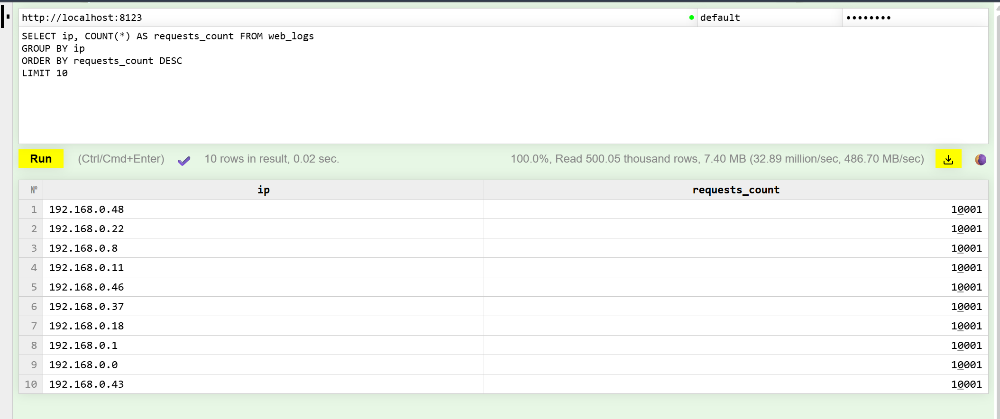
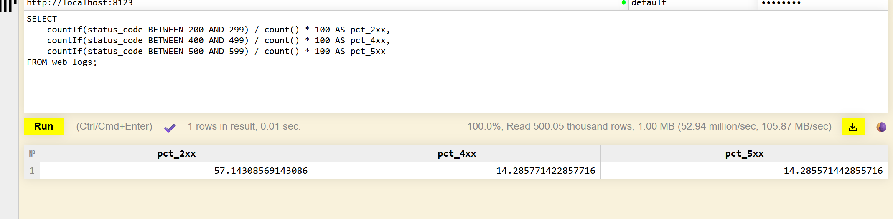
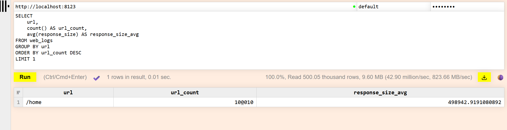
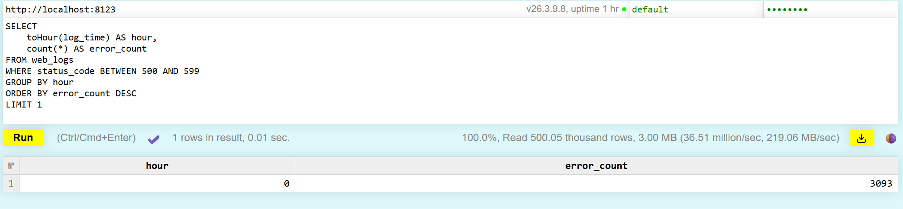

# ClickHouse — отчёт

## Задание 1

### Запросы по `web_logs`

#### Топ-10 IP по числу запросов

```SQL
SELECT ip, COUNT(*) AS requests_count FROM web_logs
GROUP BY ip
ORDER BY requests_count DESC
LIMIT 10
```



#### Доли ответов по классам статусов (2xx, 4xx, 5xx)

```SQL
SELECT
    countIf(status_code BETWEEN 200 AND 299) / count() * 100 AS pct_2xx,
    countIf(status_code BETWEEN 400 AND 499) / count() * 100 AS pct_4xx,
    countIf(status_code BETWEEN 500 AND 599) / count() * 100 AS pct_5xx
FROM web_logs;
```



#### Самый частый URL и средний размер ответа

```SQL
SELECT
    url,
    count() AS url_count,
    avg(response_size) AS response_size_avg
FROM web_logs
GROUP BY url
ORDER BY url_count DESC
LIMIT 1
```



#### Час с максимальным числом ответов 5xx

```SQL
SELECT
    toHour(log_time) AS hour,
    count(*) AS error_count
FROM web_logs
WHERE status_code BETWEEN 500 AND 599
GROUP BY hour
ORDER BY error_count DESC
LIMIT 1
```




---

## Задание 2 — сравнение с PostgreSQL

### DDL и вставка (как в методичке)

**ClickHouse**

```SQL
CREATE TABLE sales_ch (
    sale_date DateTime,
    product_id UInt64,
    category String,
    quantity UInt32,
    price Float64,
    customer_id UInt64
) ENGINE = MergeTree()
ORDER BY (sale_date);

INSERT INTO sales_ch
SELECT
    toDateTime('2024-01-01 00:00:00') + INTERVAL number MINUTE,
    number % 1000,
    arrayElement(['Electronics', 'Clothing', 'Food', 'Books'], number % 4 + 1),
    rand() % 10 + 1,
    round(rand() % 10000 / 100, 2),
    number % 50000
FROM numbers(1000000);
```

**PostgreSQL**

```SQL
CREATE TABLE sales_pg (
    sale_date timestamp,
    product_id bigint,
    category text,
    quantity integer,
    price float8,
    customer_id bigint
);

CREATE INDEX idx_sales_pg_date ON sales_pg(sale_date);
CREATE INDEX idx_sales_pg_product ON sales_pg(product_id);

INSERT INTO sales_pg
SELECT
    '2024-01-01 00:00:00'::timestamp + (n || ' minutes')::interval,
    n % 1000,
    CASE (n % 4)
        WHEN 0 THEN 'Electronics'
        WHEN 1 THEN 'Clothing'
        WHEN 2 THEN 'Food'
        ELSE 'Books'
    END,
    (random() * 9 + 1)::integer,
    round((random() * 100)::numeric, 2),
    n % 50000
FROM generate_series(1, 1000000) AS n;
```

### Запросы для замера

Агрегат «за последний календарный месяц относительно максимальной даты в таблице» (одна и та же логика в обеих СУБД):

```SQL
-- ClickHouse
SELECT count() AS rows_cnt, sum(quantity) AS qty_sum, round(sum(quantity * price), 2) AS revenue_approx
FROM sales_ch
WHERE sale_date >= ((SELECT max(sale_date) FROM sales_ch) - INTERVAL 1 MONTH);
```

```SQL
-- PostgreSQL
SELECT count(*) AS rows_cnt, sum(quantity) AS qty_sum,
       round(sum(quantity * price)::numeric, 2) AS revenue_approx
FROM sales_pg
WHERE sale_date >= (SELECT max(sale_date) FROM sales_pg) - INTERVAL '1 month';
```

Размер данных на диске:

```SQL
-- ClickHouse
SELECT formatReadableSize(sum(bytes_on_disk)) AS readable,
       sum(bytes_on_disk) AS bytes_disk,
       sum(rows) AS rows
FROM system.parts
WHERE database = 'default' AND table = 'sales_ch' AND active;
```

```SQL
-- PostgreSQL
SELECT pg_size_pretty(pg_total_relation_size('sales_pg')) AS total_pretty,
       pg_total_relation_size('sales_pg') AS total_bytes,
       pg_size_pretty(pg_relation_size('sales_pg')) AS heap_only_pretty;
```

### Логи выполнения (фактический вывод команд)

Поднятие стека (PostgreSQL добавлен рядом с ClickHouse):

```text
 Volume "clickhouse_postgres_data"  Creating
 Container postgres-lab  Creating
 Container clickhouse-lab  Running
 Container postgres-lab  Created
 Container postgres-lab  Starting
 Container postgres-lab  Started
```

ClickHouse — пересоздание таблицы и вставка 1 000 000 строк (`clickhouse-client -t`, время в секундах в последней строке):

```bash
docker exec clickhouse-lab clickhouse-client --password password --query "DROP TABLE IF EXISTS sales_ch"

docker exec clickhouse-lab clickhouse-client --password password --query "CREATE TABLE sales_ch ( sale_date DateTime, product_id UInt64, category String, quantity UInt32, price Float64, customer_id UInt64 ) ENGINE = MergeTree() ORDER BY (sale_date)"

docker exec clickhouse-lab clickhouse-client --password password -t --query "INSERT INTO sales_ch SELECT toDateTime('2024-01-01 00:00:00') + INTERVAL number MINUTE, number % 1000, arrayElement(['Electronics', 'Clothing', 'Food', 'Books'], number % 4 + 1), rand() % 10 + 1, round(rand() % 10000 / 100, 2), number % 50000 FROM numbers(1000000)"
0.161
```

ClickHouse — запрос за последний месяц (`-t`, сначала результат, затем время):

```bash
docker exec clickhouse-lab clickhouse-client --password password -t --query "SELECT count() AS rows_cnt, sum(quantity) AS qty_sum, round(sum(quantity * price), 2) AS revenue_approx FROM sales_ch WHERE sale_date >= ((SELECT max(sale_date) FROM sales_ch) - INTERVAL 1 MONTH)"
44641	245132	12236263.84
0.017
```

ClickHouse — размер на диске:

```bash
docker exec clickhouse-lab clickhouse-client --password password --query "SELECT formatReadableSize(sum(bytes_on_disk)) AS readable, sum(bytes_on_disk) AS bytes_disk, sum(rows) AS rows FROM system.parts WHERE database = 'default' AND table = 'sales_ch' AND active"
14.88 MiB	15600734	1000000
```

PostgreSQL — схема и вставка:

```bash
docker exec postgres-lab psql -U postgres -d bench -c "DROP TABLE IF EXISTS sales_pg CASCADE;"
NOTICE:  table "sales_pg" does not exist, skipping
DROP TABLE

docker exec postgres-lab psql -U postgres -d bench -c "CREATE TABLE sales_pg ( sale_date timestamp, product_id bigint, category text, quantity integer, price float8, customer_id bigint ); CREATE INDEX idx_sales_pg_date ON sales_pg(sale_date); CREATE INDEX idx_sales_pg_product ON sales_pg(product_id);"
CREATE TABLE
CREATE INDEX
CREATE INDEX

docker exec postgres-lab psql -U postgres -d bench -c "\timing on" -c "INSERT INTO sales_pg SELECT '2024-01-01 00:00:00'::timestamp + (n || ' minutes')::interval, n % 1000, CASE (n % 4) WHEN 0 THEN 'Electronics' WHEN 1 THEN 'Clothing' WHEN 2 THEN 'Food' ELSE 'Books' END, (random() * 9 + 1)::integer, round((random() * 100)::numeric, 2), n % 50000 FROM generate_series(1, 1000000) AS n;"
Timing is on.
INSERT 0 1000000
Time: 4200.117 ms (00:04.200)
```

PostgreSQL — тот же аналитический запрос:

```bash
docker exec postgres-lab psql -U postgres -d bench -c "\timing on" -c "SELECT count(*) AS rows_cnt, sum(quantity) AS qty_sum, round(sum(quantity * price)::numeric, 2) AS revenue_approx FROM sales_pg WHERE sale_date >= (SELECT max(sale_date) FROM sales_pg) - INTERVAL '1 month';"
Timing is on.
 rows_cnt | qty_sum | revenue_approx 
----------+---------+----------------
    44641 |  244650 |    12267944.43
(1 row)

Time: 78.604 ms
```

PostgreSQL — размер (куча + индексы):

```bash
docker exec postgres-lab psql -U postgres -d bench -c "SELECT pg_size_pretty(pg_total_relation_size('sales_pg')) AS total_pretty, pg_total_relation_size('sales_pg') AS total_bytes, pg_size_pretty(pg_relation_size('sales_pg')) AS heap_only_pretty;"
 total_pretty | total_bytes | heap_only_pretty 
--------------+-------------+------------------
 102 MB       |   107331584 | 73 MB
```

### Сводная таблица замеров

| Метрика | ClickHouse | PostgreSQL |
|--------|------------|------------|
| Вставка 1 000 000 строк | 0.161 s | 4200 ms (~4.20 s) |
| Запрос «последний месяц» | 0.017 s (~17 ms) | 78.6 ms |
| Размер на диске (таблица + всё связанное) | ~14.9 MiB (~15.6 MB) | ~102 MB (heap ~73 MB + индексы/служебное) |

Отношение размеров PostgreSQL / ClickHouse ≈ 107 331 584 / 15 600 734 ≈ **6.9**

### Ответы на вопросы

1. **Какая СУБД быстрее вставила 1 млн строк?**  
   В этом замере — **ClickHouse** (~0.16 s против ~4.2 s в PostgreSQL), то есть массовая вставка одним `INSERT … SELECT` оказалась быстрее примерно в **26** раз на данных и железе данного запуска.

2. **Во сколько раз ClickHouse «сжал» данные эффективнее?**  
   По отношению полного дискового следа `pg_total_relation_size('sales_pg')` к сумме `bytes_on_disk` для `sales_ch` вышло **~6.9×** меньший объём у ClickHouse при сопоставлении столбцового MergeTree без отдельных индексов с row-store и двумя B-tree индексами у PostgreSQL.

3. **Какой вывод о выборе СУБД для аналитики?**  
   Для **тяжёлого сканирования больших массивов и агрегатов по времени** (как здесь: подсчёт и суммы по месяцу) columnar-движок даёт заметный выигрыш по времени и по хранению. PostgreSQL по-прежнему уместен там, где нужны **строгая транзакционность**, сложные **JOIN**‑запросы в OLTP-профиле, уникальные ограничения на строку и смешанная нагрузка; типичное разбиение ролей: **PostgreSQL как система записи и операционное хранилище, ClickHouse как аналитическое**.

4. **Разница ClickHouse и PostgreSQL (кратко):**  

   - PostgreSQL — **строчное** хранилище, **полноценный OLTP**, ACID на уровне строк, богатые типы ограничений и индексы произвольного доступа по ключу; аналитика по полному скану больших таблиц дороже по I/O и CPU.  
   - ClickHouse — **столбцовое хранилище** под **OLAP**, сильное **сжатие столбцов**, быстрые полные сканы и агрегации при заданном `ORDER BY`; вставки чаще **батчами**, модель мутаций/индексов иная, чем классический B-tree на каждый ключ.
